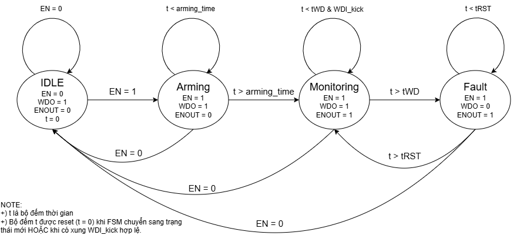
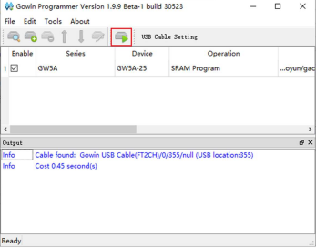

# FPGA Watchdog Timer (Mô phỏng TPS3431) trên Tang Nano 4K

**Nhóm thực hiện:** Nhóm 15  
**Cuộc thi:** CUỘC THI THIẾT KẾ MCU - FPGA HÀ NỘI 2026  
**Board:** Gowin Tang Nano 4K (Thạch anh 27MHz)  

---

## 1. Giới thiệu Dự án
Dự án này triển khai thiết kế lõi IP mô phỏng hoạt động của IC Watchdog Timer (tương tự TPS3431) trên FPGA. Hệ thống có nhiệm vụ giám sát tín hiệu "nhịp tim" (WDI) từ một hệ thống khác và xuất tín hiệu cảnh báo (WDO) nếu xảy ra sự cố treo máy (Timeout).

Hệ thống được thiết kế hoàn toàn bằng Verilog HDL, áp dụng máy trạng thái hữu hạn (FSM) và được kiểm chứng (Verification) thông qua phần mềm ModelSim với nhiều kịch bản hoạt động thực tế.

---

## 2. Cấu trúc Mô-đun (System Architecture)
Hệ thống được chia thành các mô-đun phân cấp để tối ưu hoá việc tái sử dụng code. Ngoài lõi Watchdog cơ bản, hệ thống tích hợp thêm phân hệ giao tiếp máy tính (UART Subsystem):

* `watchdog_top.v`: Mô-đun cấp cao nhất (Top-level). Nơi kết nối lõi Watchdog với các ngoại vi vật lý (nút nhấn, đèn LED, giao tiếp UART) trên board.

* `watchdog_core.v`: Lõi FSM điều khiển logic chính của Watchdog. Quản lý 4 trạng thái: IDLE (Nghỉ), ARMING (Khởi động), MONITORING (Giám sát) và FAULT (Báo lỗi).

* Khối giao tiếp UART (UART Subsystem):
    * `uart_rx.v / uart_tx.v`: Thu/phát dữ liệu UART vật lý theo chuẩn 115200 8N1. Có cơ chế chống nhiễu Metastability (dùng 2 D-FF).
    * `frame_parser.v`: Bộ phân giải gói tin (Nhận lệnh từ PC). Chịu trách nhiệm bóc tách Frame, kiểm tra mã bảo vệ (Checksum) và cập nhật cấu hình hệ thống.
    * `uart_frame_responder.v`: Bộ đóng gói phản hồi. Nhận lệnh kích hoạt từ Parser, trích xuất dữ liệu từ các thanh ghi và đóng gói trả về PC (ACK/RESP) kèm Checksum hợp lệ.

* `debounce_button.v`: Khối lọc nhiễu nút nhấn (Debounce).
    * Sử dụng kỹ thuật thanh ghi dịch (Shift Register) kết hợp xung clock chậm.
    * Bộ đếm được tham số hoá toàn phần bằng hàm `$clog2()`. Cung cấp cả tín hiệu giữ mức (Level) và xung nhọn (Pulse) bằng định lý De Morgan.

---

## 3. Lựa chọn Thiết kế & Kỹ thuật (Design Decisions)

### 3.1. Đồng bộ Logic phần cứng (Active-Low)
Để bám sát với phần cứng thực tế (nút nhấn kéo xuống GND khi bấm), lõi `watchdog_core` được thiết kế để giao tiếp hoàn toàn bằng logic **Active-Low** (`en_n`, `wdi_kick_n`). Mô-đun Debounce đảm nhiệm việc xuất ra xung Active-Low chính xác mà không cần dùng cổng NOT rườm rà ở cấp Top, giúp mạch chạy ổn định và tiết kiệm tài nguyên (LUTs).

### 3.2. Mô phỏng ngõ ra Open-Drain của TPS3431
*(Yêu cầu theo đề bài 4.3)*
Trong dự án này, em lựa chọn phương pháp đơn giản hoá để thiết kế ngõ ra cho tín hiệu WDO và ENOUT. Thay vì sử dụng chân `inout` và trạng thái trở kháng cao (`1'bz`) để mô phỏng ngõ ra Open-Drain vật lý, em sử dụng ngõ ra **Push-Pull** tiêu chuẩn của FPGA để xuất tín hiệu. Tuy nhiên, em vẫn đảm bảo tuân thủ tuyệt đối quy ước logic của chip TPS3431:
* **WDO (Active-Low):** Chủ động xuất mức 0 (`1'b0`) khi xảy ra lỗi Timeout (tWD > 1600ms) để kéo sáng LED báo lỗi, và xuất mức 1 (`1'b1`) ở trạng thái bình thường.
    * *Quy ước: LED sáng là hệ thống bình thường; LED tắt là hệ thống bị timeout.*
* **ENOUT:** Xuất logic hợp lệ (1 hoặc 0) theo đúng giản đồ thời gian quy định để điều khiển LED trạng thái.
    * *Quy ước: ENOUT = 1 báo hiệu hệ thống đang chạy.*

Phương pháp này giúp thiết kế ổn định, code RTL sạch sẽ, dễ dàng kiểm chứng trên Testbench và hoạt động hoàn hảo khi nạp trực tiếp lên các LED tích hợp sẵn trên board Tang Nano 4K.

### 3.3. Kiến trúc Thanh ghi Phân tán (Distributed Register Architecture)
Thay vì tạo một mô-đun Register File rời rạc, dự án tối ưu hóa tài nguyên bằng cách phân bố các thanh ghi cấu hình (`twd_ms`, `trst_ms`, `arm_delay_us`) trực tiếp vào bên trong khối `frame_parser`. Thanh ghi trạng thái (`STATUS`) được đóng gói tại module Top (kết hợp trạng thái lệnh đầu vào và trạng thái vật lý đầu ra). Điều này giúp giảm độ trễ định tuyến (routing latency) mà vẫn đảm bảo 100% chức năng theo đặc tả giao thức.

---

## 4. Giao thức UART (UART Communication Protocol)
Hệ thống giao tiếp với phần mềm PC qua cấu trúc gói tin (Frame) nghiêm ngặt để chống nhiễu:

* **Khung truyền (Frame Structure):** `[0x55] [CMD] [ADDR] [LEN] [DATA...] [CHK]`
* **Quy tắc Checksum (CHK):** Phép toán XOR tất cả các byte từ `[CMD]` đến hết `[DATA]`. (Không bao gồm byte Header `0x55`).
* **Baudrate mặc định:** 115200.
* **Tập lệnh hỗ trợ:**
    * `0x01` (WRITE_REG): Ghi đè cấu hình thời gian (tWD, tRST...).
    * `0x02` (READ_REG): Truy xuất giá trị thanh ghi nội bộ.
    * `0x03` (KICK): Lệnh "Đá chó" (Software Kick). Mạch trả về chuỗi `OKOK`.
    * `0x04` (GET_STATUS): Báo cáo tình trạng sức khỏe hệ thống (Mạch đang bật/tắt, có lỗi hay không).

**Tủ thanh ghi (Register Map)**
Bản đồ thanh ghi quy định các địa chỉ cấu hình và trạng thái của hệ thống thông qua giao tiếp UART:

| Addr | Tên | R/W | Độ rộng | Mô tả |
| :--- | :--- | :---: | :---: | :--- |
| `0x00` | **CTRL** | R/W | 32 | bit0 EN_SW; bit1 WDI_SRC; bit2 CLR_FAULT (write-1-to-clear) |
| `0x04` | **tWD_ms** | R/W | 32 | Timeout watchdog (đơn vị ms) |
| `0x08` | **tRST_ms** | R/W | 32 | Thời gian giữ WDO khi fault (đơn vị ms) |
| `0x0C` | **arm_delay_us** | R/W | 16 | Ignore WDI sau enable (đơn vị us) |
| `0x10` | **STATUS** | R | 32 | bit0 EN_EFFECTIVE; bit1 FAULT_ACTIVE; bit2 ENOUT; bit3 WDO; bit4 LAST_KICK_SRC |

---

## 5. Kịch bản Kiểm chứng (Testbenches)
Dự án đính kèm 5 file Testbench giả lập môi trường thực tế (Real-time simulation) với đầy đủ thông số delay:

1. `tb_normal_kick.v`: Giả lập hệ thống khoẻ mạnh, định kỳ "đá chó" (Kick) mỗi 1 giây. Kết quả: WDO luôn giữ mức 1 an toàn.
2. `tb_timeout.v`: Giả lập lỗi treo máy. Hệ thống bỏ đói Watchdog. Kết quả: WDO sụp xuống 0 chính xác ở mốc 1.6 giây, và tự phục hồi sau 200ms (tRST).
3. `tb_disable.v`: Kịch bản vô hiệu hoá (EN = 1). Dù không có tín hiệu Kick qua 1.6 giây, WDO vẫn không báo lỗi do Watchdog đang ngủ.
4. `tb_disable_to_enable.v`: Đánh thức FSM từ trạng thái IDLE sang MONITORING thành công và kích hoạt báo lỗi WDO chính xác.
5. `tb_system_uart.v` **(Kiểm chứng Giao thức Nhúng)**: Đóng giả phần mềm PC, gửi luồng sóng UART trực tiếp vào mô-đun. Thực thi chuỗi 4 bài test liên hoàn:
    * Gửi lệnh **GET_STATUS (0x04)** kiểm tra sức khoẻ.
    * Gửi lệnh **WRITE (0x01)** để nạp thông số Timeout mới (2000ms).
    * Gửi lệnh **READ (0x02)** để truy xuất mạch, chứng minh dữ liệu 2000ms đã được lưu trữ thành công vào Register.
    * Gửi lệnh **KICK (0x03)** qua cổng Serial. Mạch phản hồi chính xác mã báo nhận.

---

## 6. Sơ đồ FSM hệ thống

---

## 7. Hướng dẫn Biên dịch và Chạy Mô phỏng

**Yêu cầu phần mềm:**
* Gowin FPGA Designer (V1.9.9 hoặc mới hơn)
* ModelSim (Intel/Altera hoặc Standalone)

**Các bước nạp code:**
1. Tải về và giải nén.
2. Vào phần mềm **Gowin** rồi mở file `Contest2026\FPGA\ContestFPGA.gprj`
3. Sau đó vào tab `Process`, chọn `Synthesize` rồi nhấn `Place & Route`.
4. Kết nối bo mạch Tang Nano 4K bằng dây Type-C vào máy tính.
5. Nhấn vào `Programmer`, nhấn `Save`, sau đó chọn biểu tượng như hình dưới:  
  
> **Chú ý:** Nếu để Operation là SRAM thì khi mất nguồn sẽ phải nạp lại code. Hãy chọn chế độ Flash Mode để nạp thẳng vào flash.

**Các bước chạy Mô phỏng (Simulation):**
* Xem chi tiết trong chương 3 tại tài liệu: `Documents/Gowin-FPGA-Vietnamese-Book.pdf`

---

## 8. Kết nối phần cứng

**Yêu cầu phần cứng:**
* Board Tang Nano 4K
* LED rời
* Điện trở 220 Ohm
* Mạch USB To TTL để kiểm tra UART

**Sơ đồ đấu nối:**
* `LED (+)`           --> Pin 30 (IOR15A)
* `LED (-)`           --> Trở 220 Ohm --> GND
* `TX (USB To TTL)`   --> Pin 40 (IOT26B) của FPGA (`rx`)
* `RX (USB To TTL)`   --> Pin 39 (IOT26A) của FPGA (`tx`)
* `GND (USB To TTL)`  --> Chân GND của Tang Nano 4K